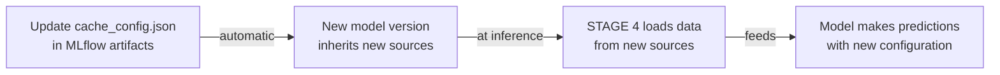

# MLflow Model Cache Configuration Analysis
## XGBoost Model Registry - Manual Registration
## Model ID: 848387cc60dd48ef8abec7a643493bde

---

## MLflow Storage Context

```
MLFLOW ARTIFACT STORE:
local/
├── mlruns/
│   ├── 1/                                       # Experiment ID
│   └── manual_reg/
│       └── 848387cc60dd48ef8abec7a643493bde/    ◄─ RUN ID
│           ├── artifacts/
│           │   └── bundle/
│           │       ├── configuration/
│           │       │   ├── cache_config.json    ◄─ THIS FILE
│           │       │   └── [other configs]
│           │       ├── models/
│           │       │   └── model.pkl            ◄─ Serialized model
│           │       └── [artifacts]
│           ├── metrics/
│           ├── params/
│           └── tags/
└── models/
    └── prophet_watt_h_AKMOLA_test/
        └── [model versions]
```

---

## Cache Configuration Role

`cache_config.json` is **stored as an MLflow artifact** and serves as:

1. **Model Loading Configuration** - Instructions for unpickling and initializing the model
2. **Data Source Registry** - Defines where the model will fetch data at inference time
3. **Runtime Parameters** - Specifies collection parameters for STAGE 4

---

## Current Cache Configuration Structure

```json
{
  "model_type": "xgb",                    // Model framework identifier
  "fallback": "none",                     // Fallback strategy if primary fails
  "sources": {                            // STAGE 4 data collection config
    "step": 3600,                         // Sampling interval
    "input_range": 168,                   // Historical lookback
    "output_range": 24,                   // Forecast horizon
    
    "historical": {                       // ✓ ACTIVE SOURCE
      "archives": [...],
      "url": "http://host.docker.internal:7080/api/v1/read/archives",
      "request_overrides": {...}
    },
    
    "weather": {                          // ◐ INACTIVE SOURCE
      "url": null,
      "lat": null,
      "lon": null,
      "units": "metric",
      "hours": null
    },
    
    "cmms": {                             // ◐ INACTIVE SOURCE
      "url": null,
      "request_overrides": {}
    }
  }
}
```

---

## Data Flow in MLflow Inference

```
┌──────────────────────────────────────────────────────────┐
│ MLflow Model Server / Client                             │
└──────────────────────────────────────────────────────────┘
                         │
                         ▼
    ┌────────────────────────────────────┐
    │ Load Artifacts from MLflow Storage │
    │ Path: 848387cc60dd48ef8abec7a643.. │
    └────────────────────────────────────┘
                         │
              ┌──────────┴──────────┐
              ▼                     ▼
    ┌─────────────────┐   ┌──────────────────────┐
    │ model.pkl       │   │ cache_config.json    │
    │ (model weights) │   │ (configuration)      │
    └─────────────────┘   └──────────────────────┘
                                    │
                    ┌───────────────┼───────────────┐
                    ▼               ▼               ▼
              ┌─────────────┐    ┌──────────┐    ┌──────────┐
              │ Historical  │    │ Weather  │    │  CMMS    │
              │ Data Loader │    │ Loader   │    │ Loader   │
              │ (ACTIVE)    │    │(Disabled)│    │(Disabled)│
              └─────────────┘    └──────────┘    └──────────┘
                    │               │               │
                    └───────────────┬───────────────┘
                                    ▼
                    ┌──────────────────────────────┐
                    │ STAGE 4: Data Collection     │
                    │ Using Parameters from Cache  │
                    │ step=3600, range=168, etc.   │
                    └──────────────────────────────┘
                                    │
                                    ▼
                    ┌──────────────────────────────┐
                    │ Model Inference              │
                    │ (STAGE 5)                    │
                    └──────────────────────────────┘
                                    │
                                    ▼
                    ┌──────────────────────────────┐
                    │ Prediction: N-hour forecast  │
                    └──────────────────────────────┘
```

---

## Key Points: MLflow Cache Configuration

### 1. **Persistence in MLflow**
- Cache config stored as artifact in MLflow RunID: `848387cc60dd48ef8abec7a643493bde`
- Loaded automatically when model is retrieved from MLflow
- Version-controlled with model artifacts

### 2. **Runtime Dependency**
When the model runs inference:
```python
# Pseudocode: How MLflow loads and uses cache_config
model = mlflow.pyfunc.load_model('runs:/848387cc60dd48ef8abec7a643493bde/bundle')

# cache_config.json is loaded here
sources_config = model.config['sources']  # Contains data collection params

# STAGE 4 collectes data using:
data = collect_stage4_data(
    step=sources_config['step'],              # 3600
    input_range=sources_config['input_range'], # 168
    sources=sources_config                    # historical, weather, cmms
)

# STAGE 5 inference
predictions = model.predict(data)
```

### 3. **Multiple Model Versions in Registry**

The cache config is specific to this model version:
```
prophet_watt_h_AKMOLA_test/
├── version 1 ─┬─ artifacts
│              ├─ cache_config.json  (config A)
│              └─ model.pkl
│
├── version 2 ─┬─ artifacts
│              ├─ cache_config.json  (config B - may differ)
│              └─ model.pkl
│
└── version 3 ─┬─ artifacts
               ├─ cache_config.json  (config C - may differ)
               └─ model.pkl
```

Each version controls its own data sources independently.

---

## Integration with Unified Configuration

The integrated `config_stage4_integrated.yaml` should be understood as:

**Tier 1: MLflow Runtime (cache_config.json)**
- What actually runs in production
- Stored in MLflow artifacts
- Version-specific
- What the model uses AT INFERENCE TIME

**Tier 2: Model Configuration (test_model_config.yaml)**
- What was used during TRAINING
- Parameters for model behavior
- Applied during model.fit()

**Tier 3: Unified Configuration (config_stage4_integrated.yaml)**
- Comprehensive reference
- For documentation and planning
- Bridges all configuration sources
- Used for validation and audit

---

## Synchronization Requirement

When updating `cache_config.json` in MLflow:



**Important**: Changes to cache_config.json must be:
1. Made in MLflow artifact storage
2. Trigger model re-registration (new version)
3. Tested before production deployment

---

## Current State Analysis

| Parameter | Value | Source | Status |
|-----------|-------|--------|--------|
| model_type | xgb | cache_config | ✓ Set |
| step | 3600 | cache_config | ✓ Set |
| input_range | 168 | cache_config | ✓ Set |
| output_range | 24 | cache_config | ✓ Set |
| historical.url | http://host.docker.internal:7080/api/v1/read/archives | cache_config | ✓ Set |
| historical.archives | [P_load archive] | cache_config | ✓ Set |
| weather.url | null | cache_config | ⚠ Not set |
| weather.lat/lon | null | cache_config | ⚠ Not set |
| cmms.url | null | cache_config | ⚠ Not set |

---

## Recommendations for Cache Config

### For MLflow Artifact Management:
1. ✓ Current historical source is properly configured
2. ⚠ Weather and CMMS sources require URL configuration
3. Consider creating alternative cache configs for different scenarios:
   - `cache_config_production.json` (all sources enabled)
   - `cache_config_testing.json` (historical only)
   - `cache_config_minimal.json` (minimal config)

### For Model Versioning:
- Each model version gets snapshot of cache_config
- Version history preserved in MLflow
- Easy rollback to previous data source configuration

---

## File Location & Access

```
MLflow Artifact URI:
  runs:/848387cc60dd48ef8abec7a643493bde/bundle/configuration/cache_config.json

Local Path:
  /Users/rustamkrikbayev/Documents/projects/forecast/local/mlruns/manual_reg/848387cc60dd48ef8abec7a643493bde/artifacts/bundle/configuration/cache_config.json

MLflow Registry:
  Model: prophet_watt_h_AKMOLA_test
  Run ID: 848387cc60dd48ef8abec7a643493bde
  Type: Manual Registration (XGBoost)
```

---

## Summary

**cache_config.json is NOT just a configuration file** — it is:
- ✓ MLflow artifact (versioned, tracked)
- ✓ Runtime initialization parameter (loaded on model.predict())
- ✓ Data source registry (STAGE 4 dependency)
- ✓ Model-version-specific (unique per registration)

Changes to this file affect:
1. How the model loads at inference time
2. Where STAGE 4 collects data
3. Model reproducibility and versioning
4. Inference pipeline behavior
